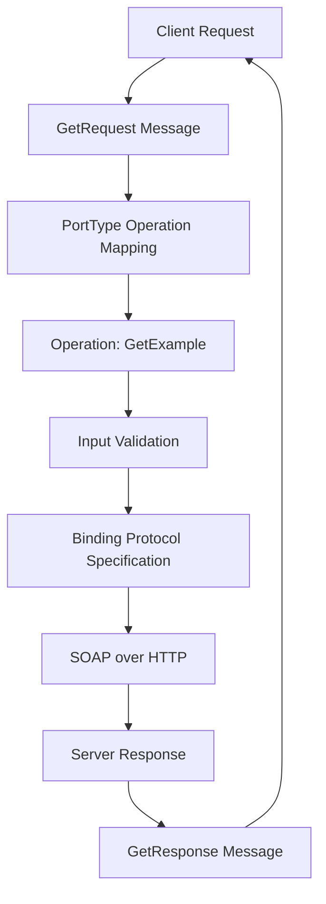

### Diagram Explanation
- **A: Client Request**: Initiates communication with the service.
- **B: GetRequest Message**: The request message is constructed using the `GetRequest` definition.
- **C: PortType Operation Mapping**: The request is mapped to a specific operation defined in the WSDL `PortType`.
- **D: Operation: GetExample**: The `GetExample` operation is executed based on the request.
- **E: Input Validation**: The input structure is validated using the WSDL `types`.
- **F: Binding Protocol Specification**: Binding information determines the communication protocol.
- **G: SOAP over HTTP**: The SOAP message is transmitted over HTTP.
- **H: Server Response**: The server processes the request and prepares a response.
- **I: GetResponse Message**: The response is provided using the `GetResponse` message structure.
