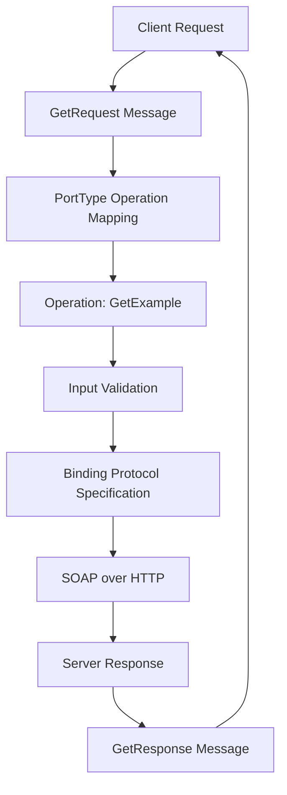

```mermaid
graph TD
    A[Client Request] --> B[GetRequest Message]
    B --> C[PortType Operation Mapping]
    C --> D[Operation: GetExample]
    D --> E[Input Validation]
    E --> F[Binding Protocol Specification]
    F --> G[SOAP over HTTP]
    G --> H[Server Response]
    H --> I[GetResponse Message]
    I --> A

    %% Diagram Explanation
    %% A: Client request initiates communication.
    %% B: Request message is constructed using GetRequest definition.
    %% C: The request is mapped to an operation defined in PortType.
    %% D: The GetExample operation is executed.
    %% E: Input structure is validated using WSDL types.
    %% F: Binding information determines the protocol for communication.
    %% G: SOAP message is transmitted over HTTP.
    %% H: The server processes the request and sends back a response.
    %% I: Response is provided using the GetResponse message structure.
```
